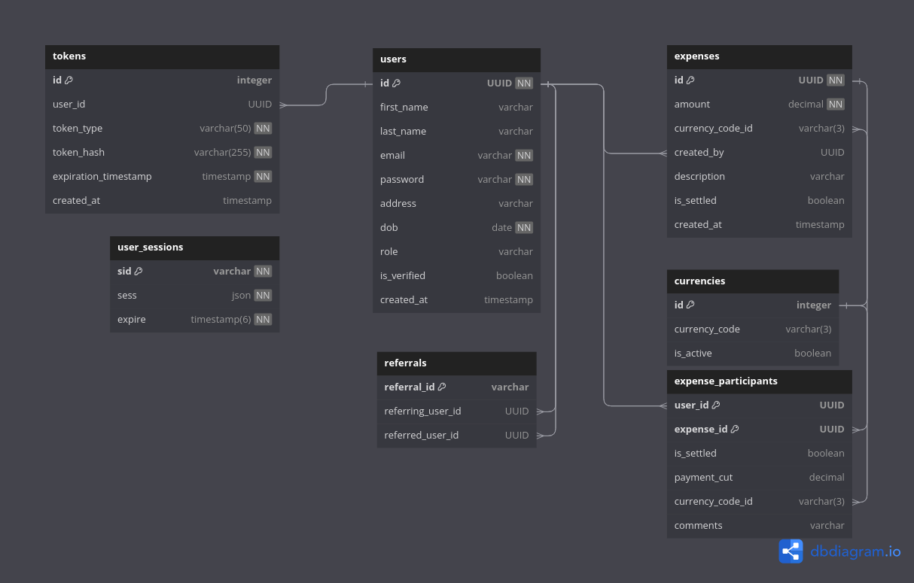

# Lets-Split-API Documentation

Welcome to the Expense Splitting App API documentation. This API is designed to simplify and streamline the process of splitting expenses among friends, family, or colleagues.

## Database Schema



## Features

C**ore Features**

1. User Authentication and Registration:
   - Secure user registration and authentication processes.
2. Expense Management:
   - Allow users to add shared expenses.
   - Provide a list of all expenses.
3. Expense Summary and Participant Breakdown:
   - Generate a dashboard with a summary of all expenses.
   - Provide a detailed breakdown of expenses by participant.
4. Settlement:
   - Enable users to settle expenses, indicating the payment method used.
   - Automatically calculate the net balance for each participant.
5. Currency Support:
   - Allow users to select the currency for each expense entry.
6. Notification and Reminders:
   - Send push notifications for new expenses and pending settlements.
   - Send reminders for overdue settlements.
7. User Feedback:
   - Collect user feedback through the app.

**Additional Features (Post-MVP)**

8. Group Expenses:
   - Create and manage expenses for specific groups of participants.
9. Expense Comments:
   - Leave comments on specific expenses for communication.
10. Advanced Reporting:
    - Generate reports with detailed expense analytics.
11. Integration with Payment Platforms:
    - Integrate with popular payment platforms (e.g., PayPal, Venmo).
12. Split Equally Option:
    - Choose an option to split an expense equally among selected participants.
13. Receipt Scanning:
    - Scan and attach receipts to expense entries.

## API Documentation

**Swagger**

Explore the API endpoints and test requests using the Swagger documentation by accessing the docs at `http://localhost:{PORT set in .env}/api/docs`

**Endpoints**

POST `/api/auth/register`: Register a new user account.\
POST `/api/auth/login`: Authenticate user login.\
POST `/api/expenses`: Create a new expense entry.\
GET `/api/expenses`: Retrieve all expenses.\
GET `/api/expenses/expense-summary`: Retrieve expense summaries and participant breakdown.\
POST `/api/expenses/settle-expense`: Mark an expense as settled.\
GET `/api/currencies`: Retrieve supported currencies.
... and more.

For detailed API documentation, visit Swagger API Documentation.

## Getting Started

### Prerequisites

Before you begin, ensure you have the following installed:

- Node.js
- npm
- PostgreSQL

### Installation

1. Clone the repository:

   ```bash
   git clone https://github.com/sudodeo/lets-split-API.git
   ```

2. Install dependencies:

   ```bash
   cd lets-split-API
   npm install
   ```

3. Create `.env` file and set environment variables using `.env.example` as a template

4. Set up the PostgreSQL database and update the configuration in config/database.js.

5. Start the server:

   ```bash
   npm start
   ```

   The API server will be running at `http://localhost:{PORT set in .env}`.

## License

This project is licensed under the terms of the
[MIT license](/LICENSE).
